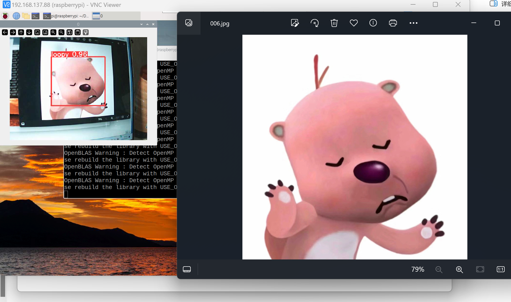
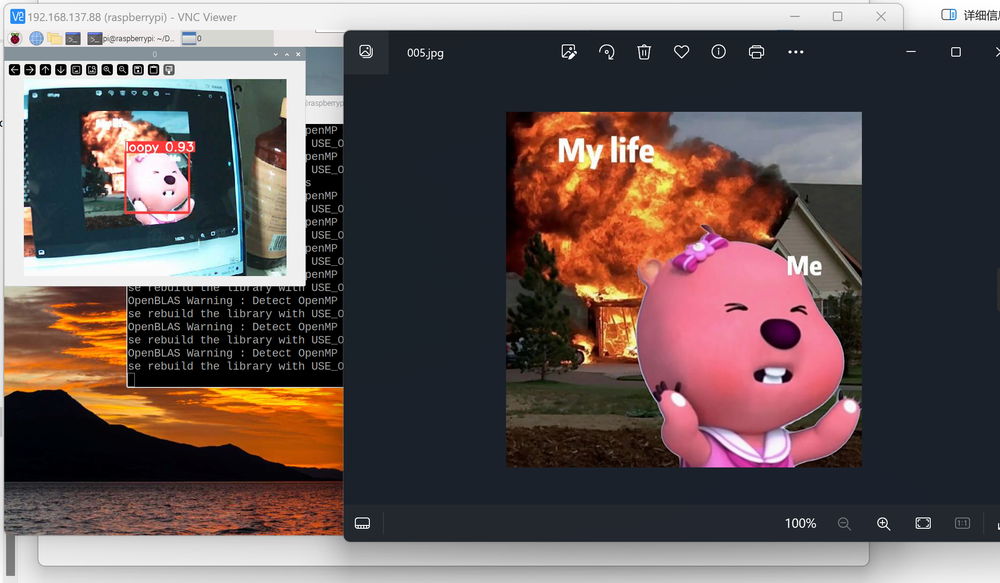
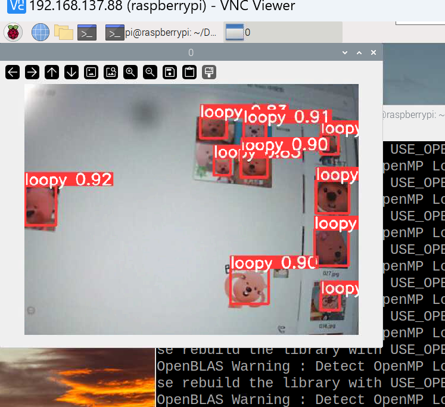
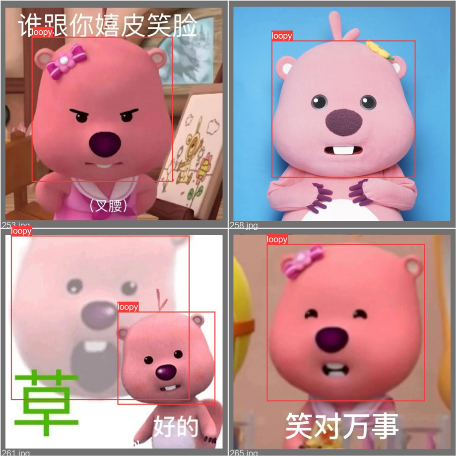

### 【树莓派】YOLOv5实时识别loopy全流程😒
### 【Raspberry PI】 YOLOv5 identifies the loopy in real time
### Author: @kkl






---

## 环境
> * PC：Win11, GTX3060(4GB)
> * 硬件：Raspberry Pi 4B
> * 摄像头：中星微摄像头（型号：USB301PL）
> * 镜像版本：2022-09-22-raspios-bullseye-arm64.img
> * 树莓派Python版本：`3.9.2`

## 前言
请提前确认摄像头和OpenCV是否可以正常使用，详情请查看我从前的文章`【树莓派】OpenCV的环境安装与基本使用`。

## 文件树
- 关联的Github仓库[戳这里](https://github.com/ZhangKeLiang0627/YOLOv5-loopy-RaspberryPi)。
```bash
RaspberryPiDeployYOLOv5/
├─1.yolov5ForTrain # 用于PC端进行模型训练
└─2.yolov5ForDetect # 用于树莓派进行实时推理
```

---

## 一、准备运动

## 1. 对树莓派

### 安装依赖
1. Pytorch
```bash
# 安装torch
pip install torch==1.8.1
# 安装torchvision
pip install torchvision==0.9.1
```

2. YOLOv5
- [戳这里:)](2.yolov5ForDetect)下载YOLOv5的依赖，这是已经整理好适配此Python版本树莓派的包。
- 将下载完的`yolov5-master.zip`放到树莓派文件路径`home/pi/Download/`中，并输入命令`unzip yolov5-master.zip`将压缩包解压到当前目录。
- 解压完成后，`cd yolov5-master/`进入文件夹。
- 使用命令`pip install -r requirement.txt`安装依赖，时间会比较长，最终看见`Successfully`类似字样则表示安装成功。

### 运行示例
- 下载：[戳这里:)](2.yolov5ForDetect)下载`yolov5s.pt`，这是YOLOv5的预训练权重文件，后续将使用此模型来进行示例测试。
- 文件传输：将此模型复制到之前解压好的`yolov5-master`文件夹当中。
- 运行代码：在`yolov5-master`文件夹中，运行命令`python detect.py`，倘若出现`Results saved to run/detect/expX`，代表代码执行成功，你可以前往此路径查看预测结果图片。

## 2. 对Windows端PC

### 创建虚拟环境
```bash
conda create -n yolov5_60 python=3.8

conda activate yolov5_60
```

### 安装依赖
1. Pytorch
```bash
pip3 install torch torchvision torchaudio --index-url https://download.pytorch.org/whl/cu118
```

2. YOLOv5
- [戳这里:)](1.yolov5ForTrain)下载YOLOv5的依赖，这是在PC端训练使用的包，此包中已经含有`yolov5s.pt`。
- 解压完成后，进入文件夹。
- 使用命令`pip install -r requirement.txt`安装依赖，时间会比较长，最终看见`Successfully`类似字样则表示安装成功。发生报错不要紧，要是模块没有当前的版本，我们就挑一个稍微靠近的版本就行。
- 训练模型：`train.py`中的参数已经手动进行修改，使用命令`python train.py`，训练完成会在`runs/train/expX/weight`中生成训练好的模型，我们将`test.pt`扔到树莓派解压后的文件夹中即可。

> 常见报错
> - 报错：RuntimeError: result type Float can't be cast to the desired output type __int64 -> [解决方法](https://blog.csdn.net/qq_43573527/article/details/132963466?ops_request_misc=%257B%2522request%255Fid%2522%253A%2522171870434616800215045407%2522%252C%2522scm%2522%253A%252220140713.130102334..%2522%257D&request_id=171870434616800215045407&biz_id=0&utm_medium=distribute.pc_search_result.none-task-blog-2~all~sobaiduend~default-1-132963466-null-null.142)
> - 报错：cache文件已存在 -> 解决方法：前往`data/loopy/labels`删除所有文件后缀`.cache`的文件即可。
> 

---

## 二、推理运动

### 1. 对树莓派
`cd home/pi/Download/yolov5-master/`，输入命令`python3 detect.py --weight best_loopy.pt --source 0`，注意`best_loopy.pt`即为我们在PC端训练好的模型！`--source 0`表示使用摄像头实时进行识别。

### 2. 对PC端
`python detect.py --weight best_loopy.pt --source 0`

---

### 后记
- 可可爱爱的loopy来自这里[数据集来源](https://github.com/ZhangKeLiang0627/YOLOv8-loopy)。
- 关联的Github仓库[戳这里](https://github.com/ZhangKeLiang0627/YOLOv5-loopy-RaspberryPi)。